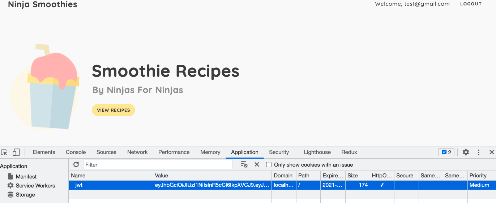

# smoothie-app

App to practice Node JWT Auth. The user can sign up and login for an account. When the user signs up, the password is hashed and a JWT token is created. The token in stored as a cookie throughout the session. When the user logins in, a JWT token is also created during the duration of the session. User can logout as well.

The password is hashed through bcrypt and error handling is displayed through the user if there is an incorrect email and password.



|                                         |                                         |                                                   |
| :-------------------------------------: | :-------------------------------------: | :-----------------------------------------------: |
|      [Introduction](#smoothie-app)      | [Table of Contents](#table-of-contents) | [Development Highlights](#development-highlights) |
|      [Installation](#installation)      |    [Page Directory](#page-directory)    |       [Code Hightlights](#code-highlights)        |
| [Technologies Used](#Technologies-Used) |           [Credits](#Credits)           |                [License](#License)                |

## Development Highlights

- Use JWT for to keep track of users authentication.
- Create middleware to check if ther is a JWT for each route.
- Store uses on MongoDB Atlas.
- Handle and communication login errors to user.

## Installation

```
npm i
node app.js
```

## Page Directory

This app uses the MVC paradigm.

## Code Highlights

Create a JWT on signup route.

```JavaScript
module.exports.signup_post = async (req, res) => {
    const { email, password } = req.body;

    try {
        const user = await User.create({ email, password });
        const token = createToken(user._id);
        res.cookie('jwt', token, { httpOnly: true, maxAge: maxAge * 1000 });
        res.status(201).json({ user: user._id });
    }
    catch (err) {
        const errors = handleErrors(err);
        res.status(400).json({ errors });
    }

}
```

Check that there is a user as a middleware for routes.

```JavaScript
const checkUser = (req, res, next) => {
    const token = req.cookies.jwt;
    if (token) {
        jwt.verify(token, 'net ninja secret', async (err, decodedToken) => {
            if (err) {
                console.log(err.message);
                res.locals.user = null;
                next();
            } else {
                console.log(decodedToken);
                let user = await User.findById(decodedToken.id)
                res.locals.user = user;
                next();
            }
        });

    } else {
        res.locals.user = null;
        next();
    }
}
```

## Technologies

### Frontend

- [JavaScript](https://www.javascript.com/)
- [CSS](https://www.w3schools.com/css/)

### Backend

- [Node.js](https://nodejs.org/en/)

### Backend Framework

- [Express.js](https://expressjs.com/)

### Database

- [MongoDB](https://www.mongodb.com/)

### Authentication

- [JWT](https://jwt.io/introduction)

## Credits

This project was apart of the [The Net Ninja](https://www.youtube.com/watch?v=SnoAwLP1a-0&list=PL4cUxeGkcC9iqqESP8335DA5cRFp8loyp) tutorial.

|                           |                                                                                                                                                                                                       |
| ------------------------- | ----------------------------------------------------------------------------------------------------------------------------------------------------------------------------------------------------- |
| **David Anusontarangkul** | [ LinkedIn](https://www.linkedin.com/in/anusontarangkul/) [ GitHub](https://github.com/anusontarangkul) |

## License

[](https://opensource.org/licenses/MIT)
